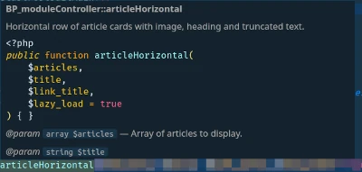

# Code Best Practices

## PHP Code

### PHP tags

- PHP Tags should be the full tags (`<?php` and `?>`)
- If not inline, PHP tags should be on their own line with a blank line before or after and on the same indent level as the next or previous line of PHP code.

```php
<?php
if() {
?>
```

Don't use shorthand PHP tages, like `<? ... ?>` or `<?= ... ?>`.

Use single quotes unless something in the string needs to be evaluated. Try to avoid escaping quotes in a string.

```php
echo '<a href="/static/link" class="button button-primary">Link name</a>';
echo "<a href='{$escaped_link}'>text with a ' single quote</a>";
```

### Naming Convention

Variable, action/filter, and function names should be clear without verbosity. Don't unnecessarily shorten names, and be careful about reserved keywords and names used by WordPress.

- Variable names should
- Action/Filter names should
- Function names should

### Whitespace

Always put a space after commas, and on both sides of operators. There is no need for spaces after or before brackets, except for clarity.

```php
CONSTANT === 23;
Func1() && Func2();
array(1, 2, 3);
$str1 . 'add this';
```

Control statements (i.e. if, while, etc.) should be written with the keyword in lower case, the parens right next to the keyword, and the braces separated by a space. Extensions like 'else' can be written on the same line as the previous '}' separated by a space.

```php
if($thingy === TRUE) {
   # Do Something
} else {
   # Do Something Else
}

foreach($forest as $tree) {
   CutDown($tree);
}
```

Always remove whitespace at the end of lines. Always leave a single extra newline at the end of a file.

### PHP Inline Documentation

All PHP code should be documented internally largely following the [WordPress inline documentation standards](https://developer.wordpress.org/coding-standards/inline-documentation-standards/php/). If these standards are followed, then most IDEs will detect the information and show it when needed. This makes it much easier to write code in a consistent way.

#### examples

- A typical method of the main module controller

```php
/**
 * Horizontal row of article cards with image, heading and truncated text.
 * 
 * @param array $articles Array of articles to display.
 * @param string $title Title of section, if needed. Can be null, which eliminates it.
 * @param string $link_title Relative URL to use as link for more of the same.
 * @param bool $lazy_load Default: true. Lazy load images used by the cards.
 * 
 * @return void 
 */
public function articleHorizontal($articles, $title, $link_title, $lazy_load = true) {
   # function code
   ...
}
```
This will show up in VSCode when you mouseover the function anywhere it's called.

